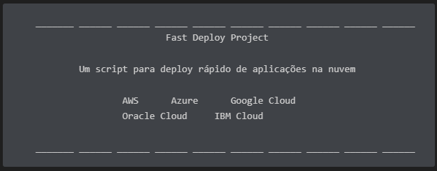

# PROJETO FAST DEPLOY

## Objetivo do Projeto

#### O projeto Fast Deploy tem como finalidade oferecer, de forma gratuita, um conjunto de pequenas aplicações para estudantes de desenvolvimento, cloud e para aqueles que necessitam fazer deploy de aplicações prontas. O Fast Deploy é um script que permite um deploy rápido e eficiente dessas aplicações em diferentes serviços de nuvem, como AWS, Azure, Google Cloud, Oracle Cloud e IBM Cloud.

## O que abrange

#### Nosso projeto Fast Deploy oferece um conjunto de aplicações WEB prontas para deploys rápidos em servidores VPS LINUX ou DOCKER. É uma ferramenta gratuita destinada a estudantes de desenvolvimento e profissionais da área que precisam de uma solução ágil para colocar suas aplicações em produção. Com nosso script, você pode escolher a stack de sua preferência (Python, ReactJS, PHP, Java, Dart, .Net) e realizar o deploy em poucos passos simples e intuitivos. Não é necessário se preocupar com a configuração do ambiente ou com a instalação de dependências - nosso script cuida disso para você. Com o Fast Deploy, você pode se concentrar no desenvolvimento de suas aplicações e deixar o processo de deploy para nós. Experimente agora mesmo e agilize seus processos de desenvolvimento e deploy!

## Quem pode usar?
#### O Fast Deploy é um projeto que visa fornecer um conjunto de pequenas aplicações web para que estudantes de desenvolvimento e entusiastas da área possam realizar deploys rápidos em servidores VPS Linux ou Docker. Com o Fast Deploy, você pode economizar tempo e recursos, pois não precisa desenvolver uma aplicação do zero para testar o ambiente em nuvem recém-criado. Oferecemos diversos exemplos de aplicações, como controle de estoque, calculadora IMC, pequenas APIs e muito mais. Experimente agora e tenha uma experiência mais rápida e eficiente em seus deploys.

## Como usar

#### Para usar o Fast Deploy, basta clonar o repositório em sua máquina local e seguir as instruções de cada script. É possível escolher entre fazer o deploy em Docker ou VPS, e também escolher a tecnologia desejada.

## Contribuição
#### Se você deseja contribuir com o projeto, basta realizar um fork do repositório, fazer as alterações necessárias e criar uma pull request. Sua contribuição será muito bem-vinda!

## Licença
#### Este projeto está sob a licença MIT.
